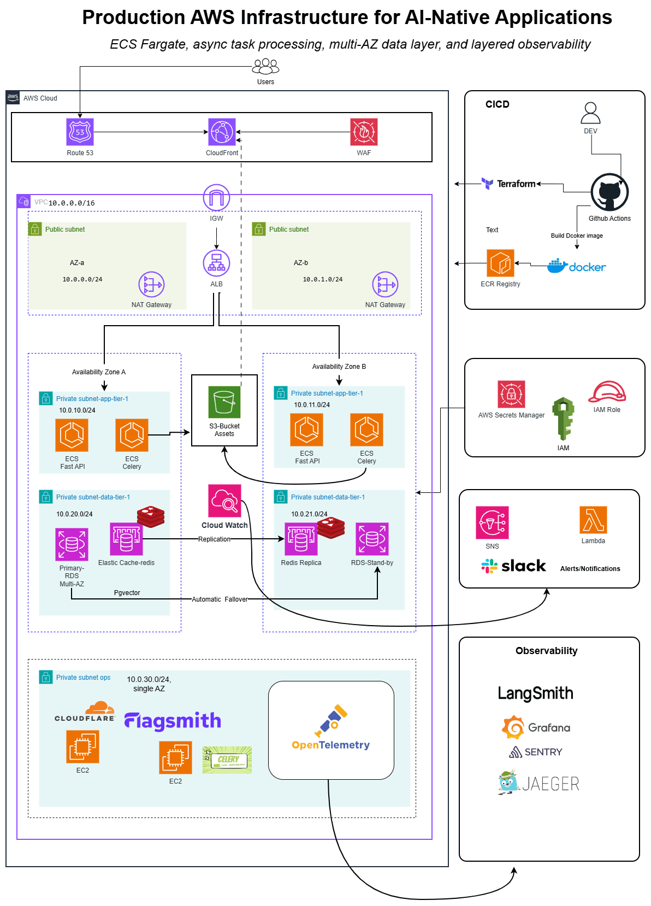
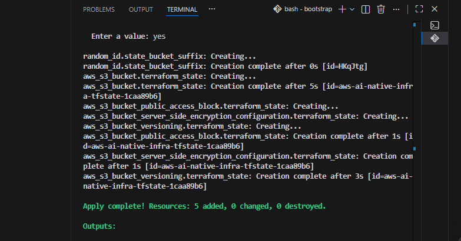

# Production AWS Infrastructure for AI-Native Applications

Built on Amazon ECS Fargate - async task processing, multi-AZ data layer, layered observability.


## Project Overview

A production-style AWS platform for an **AI-native, asynchronous
content-generation system**: a FastAPI service and Celery workers running as two
independent Amazon ECS Fargate services, generating personalized messages
through OpenAI, backed by a multi-AZ RDS Postgres (with pgvector for
similarity search) and ElastiCache Redis data layer, fronted by CloudFront/WAF, and
released through a fully decoupled Terraform/CI-CD deploy model with a two-pipeline
observability stack (OpenTelemetry, Grafana Cloud, Jaeger, self-hosted Flower on the
application side; CloudWatch → SNS → Lambda → Slack as the single infra alerting
channel).

Every layer - networking, compute, async task processing, data resilience, release
strategy, and observability - is built as real, working infrastructure rather than a
proof of concept. Terraform provisions the shape of the AWS architecture; the platform
running on top of it, submitting a real prompt and getting a real AI-generated result
back through the full pipeline, is the point.


## Architecture



### User flow

```
End users
   |
   v
Route 53 -> CloudFront (WAF attached at the edge) -> ALB
   |
   v
ECS Fargate: FastAPI service  --->  ElastiCache Redis queue  --->  ECS Fargate: Celery workers
   |                                                                    |
   v                                                                    v
RDS Postgres 16 (pgvector, Alembic)                            OpenAI API
                                                                         |
                                                                         v
                                                                  S3 (generated assets)
                                                                         |
                                                                         v
                                                              CloudFront (read path, via OAC)
```

### Multi-AZ network layout

VPC `10.0.0.0/16`, two availability zones, 7 subnets total - see
[docs/ARCHITECTURE.md](docs/ARCHITECTURE.md) for the full CIDR table and security group
chain.

### CI/CD - decoupled deploy

```
                      GitHub Actions
                     /              \
                    /                \
      Terraform plan/apply      Build Docker image
      (infra shape only)                |
                                        v
                              Push to ECR:
                              immutable :sha tag
                              + moving :prod tag
                                        |
                                        v
                          aws ecs update-service
                          --force-new-deployment
                                        |
                                        v
                                 ECS Fargate
```

## Infrastructure Overview

**Networking**
- VPC, 2 public subnets, 2 app-tier subnets, 2 data-tier subnets, 1 single-AZ ops subnet
- Internet Gateway
- NAT: fck-nat (dev/staging) or real NAT Gateway per AZ (prod), variable-driven
- Route tables per subnet tier

**Security**
- ALB SG (internet-facing) -> App SG (ALB only) -> Data SG (App only, plus one narrow,
  documented exception for Flower -> Redis); Ops SG has no internet-facing inbound rule
  at all
- IAM roles/policies scoped per ECS task (execution role vs. task role) and per EC2
  instance (Cloudflare Tunnel, Flagsmith, OTel collector, Flower)
- AWS Secrets Manager for every credential - either Terraform-generated
  (`random_password`) or flowed in via `TF_VAR_`-prefixed GitHub Actions secrets, never
  hardcoded, never committed
- WAF Web ACL attached at the CloudFront edge

**Platform**
- ECS Fargate cluster with **two separate services** - FastAPI and Celery - never combined
- RDS PostgreSQL 16 + pgvector, Multi-AZ in prod, Alembic migrations
- ElastiCache Redis as a replication group with automatic failover in prod
- S3 asset bucket, CloudFront with Origin Access Control, Route 53, ACM
- Self-hosted Flagsmith (EC2 + its own RDS) for feature flags
- Cloudflare Tunnel on EC2, replacing a bastion host entirely
- Self-hosted OpenTelemetry collector + Jaeger, Flower (Celery monitoring)
- CloudWatch alarms -> SNS -> Lambda -> Slack, the one infra alerting channel

## Component / Purpose

| Component | Purpose |
|---|---|
| ALB | Routes HTTPS traffic to the ECS FastAPI service |
| ECS FastAPI service | Accepts generation requests, enqueues jobs |
| ECS Celery service | Consumes the queue, calls OpenAI, stores the result |
| RDS Postgres + pgvector | Job/user data, plus embeddings for similarity search |
| ElastiCache Redis | Celery broker |
| S3 | Stores generated message assets |
| CloudFront + WAF | Edge delivery and attack-surface protection for asset reads |
| Flagsmith | Self-hosted feature flag evaluation |
| Cloudflare Tunnel | Outbound-only admin/internal access - no public bastion. Proxies Jaeger/Flower/Flagsmith to a delegated admin subdomain, gated by Cloudflare Access |
| OTel Collector + Jaeger | App-level traces/metrics -> Grafana Cloud + self-hosted Jaeger |
| Flower | Standalone Celery queue/worker visibility - no external forwarding |
| CloudWatch -> SNS -> Lambda -> Slack | The one infra alerting/paging channel |
| Next.js frontend | Submit a prompt, poll status, see the generated result |

## Platform Engineering Decisions

**ECS Fargate, not EKS.** Two separate ECS services (FastAPI, Celery) on one cluster -
never combined into a single task definition, so each can scale and deploy
independently.

**Terraform owns infra shape; GitHub Actions owns the release.** Terraform never
diffs a container image tag. On every deploy, GitHub Actions pushes an immutable
`:<git-sha>` tag (audit/rollback trail) *and* repoints the moving `:prod` tag, then
calls `aws ecs update-service --force-new-deployment`. Rollback is re-pointing `:prod`
at a prior SHA and re-running the deploy step - a real code path
(`workflow_dispatch` + `rollback_sha`), not just a documented procedure.

**Multi-AZ, but scoped by environment.** RDS Multi-AZ and an ElastiCache replication
group with automatic failover are prod-only, following the same cost/resilience logic
as fck-nat (dev/staging) vs. real NAT Gateway (prod). Non-prod runs single-AZ because
nothing there needs to survive an AZ outage.

**Cloudflare Tunnel instead of a bastion host.** The ops subnet has zero
internet-facing inbound rules; Cloudflare Tunnel's outbound-only connection is the sole
path to internal tooling. The tunnel itself is Terraform-owned end to end via the
Cloudflare provider, not a value pasted in once from the dashboard. Admin UIs
(Jaeger, Flower, Flagsmith) sit behind `admin.rivetrecords.online`, a subdomain
delegated to Cloudflare via NS records so the tunnel can route to them by
hostname (`jaeger.`, `flower.`, `flagsmith.admin.rivetrecords.online`) and
Cloudflare Access can gate them - one-time PIN to an explicit email allow-list,
since none of the three tools has its own login.

**Self-hosted Flagsmith**, not a SaaS feature-flag vendor - its own EC2 instance and
its own small RDS instance, reachable only internally.

**Two independent observability pipelines, not one fan-out.** App-level: OTel
collector -> Grafana Cloud + self-hosted Jaeger (one EC2, two containers), with Flower
as a standalone self-hosted leaf node. Infra-level: CloudWatch -> SNS -> Lambda ->
Slack, deliberately the *only* alerting channel - avoids alert fatigue from multiple
tools paging independently.

**Secrets always via AWS Secrets Manager.** Either Terraform-generated
(`random_password`, for values with no external origin) or flowed in via
`TF_VAR_`-prefixed GitHub Actions secrets for values that originate outside AWS
entirely (a Cloudflare tunnel token, a Slack webhook, an OpenAI API key) - never
hardcoded, never a plain env var, never committed.

## Live Validation

Real commands run against the deployed `dev` stack (`494472951824`, `us-east-1`), not
local or mocked. Screenshots below are dashboard-only proof I can't capture myself
(no browser access) — filenames are the drop-in target once added.

### Phase 0 — S3 backend bootstrap



### Phase 1 — Networking

```powershell
aws ec2 describe-vpcs --filters "Name=tag:Project,Values=aws-ai-native-infra" --region us-east-1
```
```
CIDR: 10.0.0.0/16   State: available   VpcId: vpc-08253a85fd057cc36

7 subnets, 2 AZs:
  aws-ai-native-infra-dev-public-us-east-1a   10.0.0.0/24    us-east-1a
  aws-ai-native-infra-dev-public-us-east-1b   10.0.1.0/24    us-east-1b
  aws-ai-native-infra-dev-app-us-east-1a      10.0.10.0/24   us-east-1a
  aws-ai-native-infra-dev-app-us-east-1b      10.0.11.0/24   us-east-1b
  aws-ai-native-infra-dev-data-us-east-1a     10.0.20.0/24   us-east-1a
  aws-ai-native-infra-dev-data-us-east-1b     10.0.21.0/24   us-east-1b
  aws-ai-native-infra-dev-ops                 10.0.30.0/24   us-east-1a
```

### Phase 2 — Database (RDS)

```powershell
aws rds describe-db-instances --db-instance-identifier aws-ai-native-infra-dev-pg --region us-east-1
```
```
Status: available   MultiAZ: False   Engine: 16.14
Endpoint: aws-ai-native-infra-dev-pg.ck7s2mwimijt.us-east-1.rds.amazonaws.com
```

### CI/CD — OIDC federation

```powershell
aws cloudtrail lookup-events --lookup-attributes AttributeKey=EventName,AttributeValue=AssumeRoleWithWebIdentity --region us-east-1
```
```
repo:iampryce/Production-AWS-Infrastructure-for-AI-Native-Applications...:environment:dev
2026-07-22T19:09:20+01:00 — real GitHub Actions run assuming the OIDC role, no static AWS keys
```

### Phase 3 — Redis

```powershell
aws elasticache describe-replication-groups --replication-group-id aws-ai-native-infra-dev-redis --region us-east-1
```
```
Status: available   AutomaticFailover: disabled (dev)   NumNodeGroups: 1
```

### Phase 4 — ECS Fargate services

```powershell
aws ecs describe-services --cluster aws-ai-native-infra-dev --services aws-ai-native-infra-dev-fastapi aws-ai-native-infra-dev-celery --region us-east-1
```
```
aws-ai-native-infra-dev-fastapi   ACTIVE   desired 1 / running 1
aws-ai-native-infra-dev-celery    ACTIVE   desired 1 / running 1
```

### Phase 5 — Decoupled deploy pipeline

```powershell
aws ecr describe-images --repository-name aws-ai-native-infra-dev-fastapi --region us-east-1
```
```
Tags: [prod, b88cddf]   Pushed: 2026-07-22T19:09:48+01:00
```
Immutable SHA tag and moving `:prod` tag land on the same image, every deploy.

### Phase 6 — Edge / CDN / WAF

```powershell
curl -sD - https://rivetrecords.online
```
```
HTTP/1.1 200 OK
X-Cache: Miss from cloudfront
Via: 1.1 f3b1eb7b4b97ee701a8bdffe0c088442.cloudfront.net (CloudFront)
X-Amz-Cf-Pop: LHR5-P4

{"status":"ok"}
```

### Phase 7 — Cloudflare Tunnel

```powershell
aws ec2 describe-instances --filters "Name=tag:Name,Values=aws-ai-native-infra-dev-cloudflare-tunnel" --region us-east-1
```
```
State: running   PrivateIp: 10.0.30.26
```


### Phase 8 — Self-hosted Flagsmith

```powershell
aws ec2 describe-instances --filters "Name=tag:Name,Values=aws-ai-native-infra-dev-flagsmith" --region us-east-1
aws rds describe-db-instances --db-instance-identifier aws-ai-native-infra-dev-flagsmith-pg --region us-east-1
```
```
EC2:  running
RDS:  available
```

### Phase 9 — Observability

```powershell
aws cloudwatch describe-alarms --alarm-name-prefix aws-ai-native-infra-dev --region us-east-1
```
```
alb-target-5xx-high      OK
alb-unhealthy-hosts      OK
celery-cpu-high          OK
celery-memory-high       OK
fastapi-cpu-high         OK
fastapi-memory-high      OK
redis-evictions          OK
rds-cpu-high             INSUFFICIENT_DATA (no load in dev)
rds-free-storage-low     INSUFFICIENT_DATA (no load in dev)
redis-cpu-high           INSUFFICIENT_DATA (no load in dev)
```


### Phase 10 — Backend API

```powershell
curl -X POST https://rivetrecords.online/generations -d '{"prompt":"a short congratulations message"}'
curl https://rivetrecords.online/generations/<id>
```
```
POST -> {"id":"e4a178af-...","status":"pending", ...}
GET  -> {"id":"e4a178af-...","status":"completed","result_url":"https://rivetrecords.online/assets/generations/e4a178af-....json"}
```

### Phase 11 — Worker + generated asset

```powershell
aws logs tail /ecs/aws-ai-native-infra-dev-celery --since 5m --region us-east-1
curl https://rivetrecords.online/assets/generations/<id>.json
```
```
[INFO/MainProcess] Task generate_content[...] received
[INFO/ForkPoolWorker-1] HTTP Request: POST https://api.openai.com/v1/chat/completions "200 OK"
[INFO/ForkPoolWorker-1] Task generate_content[...] succeeded in 2.4s

{"message": "Congratulations on your new position! ..."}
```

### Phase 12 — Frontend


## Author

Oluwatobi Ogundimu

GitHub: https://github.com/iampryce

LinkedIn: https://www.linkedin.com/in/oluwatobi-ogundimu-a1341a39b/
