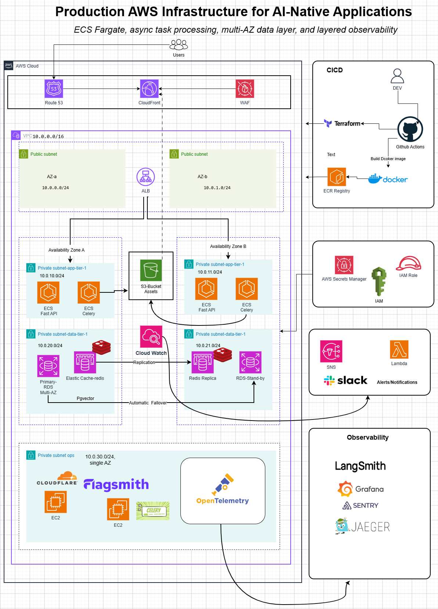

# Production AWS Infrastructure for AI-Native Applications

Built on Amazon ECS Fargate — async task processing, multi-AZ data layer, layered observability.


## Project Overview

A production-style AWS platform for an **AI-native, asynchronous
content-generation system**: a FastAPI service and Celery workers running as two
independent Amazon ECS Fargate services, generating personalized images and messages
through OpenAI/Gemini/OpenRouter, backed by a multi-AZ RDS Postgres (with pgvector for
similarity search) and ElastiCache Redis data layer, fronted by CloudFront/WAF, and
released through a fully decoupled Terraform/CI-CD deploy model with a two-pipeline
observability stack (OpenTelemetry, Grafana Cloud, Jaeger, Sentry, and LangSmith on the
application side; CloudWatch → SNS → Lambda → Slack as the single infra alerting
channel).

Every layer — networking, compute, async task processing, data resilience, release
strategy, and observability — is built as real, working infrastructure rather than a
proof of concept. Terraform provisions the shape of the AWS architecture; the platform
running on top of it is the point.

## Terraform Providers Used

- AWS provider: https://registry.terraform.io/providers/hashicorp/aws/latest
- Cloudflare provider (added in Phase 7, for the tunnel module): https://registry.terraform.io/providers/cloudflare/cloudflare/latest

Every module under `terraform/modules/` is hand-written from primitive AWS resources
rather than composed from public registry modules, so each design decision stays
deliberate and explainable end to end.

## Architecture

### User flow

```
End users
   |
   v
Route 53 -> CloudFront (WAF attached at the edge) -> ALB
   |
   v
ECS Fargate: FastAPI service  --->  ElastiCache Redis queue  --->  ECS Fargate: Celery workers
   |                                                                    |
   v                                                                    v
RDS Postgres 16 (pgvector, Alembic)                          AI provider (OpenAI/Gemini/OpenRouter)
                                                                         |
                                                                         v
                                                                  S3 (generated assets)
                                                                         |
                                                                         v
                                                              CloudFront (read path, via OAC)
```

### Multi-AZ network layout

VPC `10.0.0.0/16`, two availability zones, 7 subnets total — see
[docs/ARCHITECTURE.md](docs/ARCHITECTURE.md) for the full CIDR table and security group
chain. A finalized diagram export will land in [docs/screenshots/](docs/screenshots/)
once Phase 15 (diagram polish) is complete.

### CI/CD — decoupled deploy

```
                      GitHub Actions
                     /              \
                    /                \
      Terraform plan/apply      Build Docker image
      (infra shape only)                |
                                        v
                              Push to ECR:
                              immutable :sha tag
                              + moving :prod tag
                                        |
                                        v
                          aws ecs update-service
                          --force-new-deployment
                                        |
                                        v
                                 ECS Fargate
```

## Infrastructure Overview

**Networking**
- VPC, 2 public subnets, 2 app-tier subnets, 2 data-tier subnets, 1 single-AZ ops subnet
- Internet Gateway
- NAT: fck-nat (dev/staging) or real NAT Gateway per AZ (prod), variable-driven
- Route tables per subnet tier

**Security**
- ALB SG (internet-facing) -> App SG (ALB only) -> Data SG (App only); Ops SG has no
  internet-facing inbound rule at all
- IAM roles/policies scoped per ECS task (execution role vs. task role)
- AWS Secrets Manager, referenced via Terraform data sources only
- WAF Web ACL attached at the CloudFront edge

**Platform**
- ECS Fargate cluster with **two separate services** — FastAPI and Celery — never combined
- RDS PostgreSQL 16 + pgvector, Multi-AZ in prod, Alembic migrations
- ElastiCache Redis as a replication group with automatic failover in prod
- S3 asset bucket, CloudFront with Origin Access Control, Route 53, ACM
- Self-hosted Flagsmith (EC2 + its own RDS) for feature flags
- Cloudflare Tunnel on EC2, replacing a bastion host entirely
- Self-hosted OpenTelemetry collector, Flower (Celery monitoring)

## Component / Purpose

| Component | Purpose |
|---|---|
| ALB | Routes HTTPS traffic to the ECS FastAPI service |
| ECS FastAPI service | Accepts generation requests, enqueues jobs |
| ECS Celery service | Consumes the queue, calls the AI provider, generates content |
| RDS Postgres + pgvector | Job/user data, plus embeddings for similarity search |
| ElastiCache Redis | Celery broker/result backend |
| S3 | Stores generated image/message assets |
| CloudFront + WAF | Edge delivery and attack-surface protection for asset reads |
| Flagsmith | Self-hosted feature flag evaluation |
| Cloudflare Tunnel | Outbound-only admin/internal access — no public bastion |
| OTel Collector | App-level traces/metrics -> Grafana Cloud + Jaeger |
| CloudWatch -> SNS -> Lambda -> Slack | The one infra alerting/paging channel |

## Platform Engineering Decisions

**ECS Fargate, not EKS.** Two separate ECS services (FastAPI, Celery) on one cluster —
never combined into a single task definition, so each can scale and deploy
independently.

**Terraform owns infra shape; GitHub Actions owns the release.** Terraform never
diffs a container image tag. On every deploy, GitHub Actions pushes an immutable
`:<git-sha>` tag (audit/rollback trail) *and* repoints the moving `:prod` tag, then
calls `aws ecs update-service --force-new-deployment`. Rollback is re-pointing `:prod`
at a prior SHA and re-running the deploy step.

**Multi-AZ, but scoped by environment.** RDS Multi-AZ and an ElastiCache replication
group with automatic failover are prod-only, following the same cost/resilience logic
as fck-nat (dev/staging) vs. real NAT Gateway (prod) — non-prod runs single-AZ because
nothing there needs to survive an AZ outage.

**Cloudflare Tunnel instead of a bastion host.** The ops subnet has zero
internet-facing inbound rules; Cloudflare Tunnel's outbound-only connection is the sole
path to internal tooling.

**Self-hosted Flagsmith**, not a SaaS feature-flag vendor — its own EC2 instance and
its own small RDS instance, reachable only internally.

**Two independent observability pipelines, not one fan-out.** App-level: OTel
collector -> Grafana Cloud + Jaeger, with Sentry and LangSmith wired in via their own
SDKs directly (not routed through the collector), and Flower as a standalone
self-hosted leaf node. Infra-level: CloudWatch -> SNS -> Lambda -> Slack, deliberately
the *only* alerting channel — avoids alert fatigue from multiple tools paging
independently.

**Secrets always via AWS Secrets Manager**, referenced through Terraform data sources
— never hardcoded, never a plain env var, never committed.

## Project Execution

Status legend: ✅ done · 🔄 in progress · ⬜ planned

### Phase 0 — Repo scaffolding ✅
- [x] Directory structure per `docs/ARCHITECTURE.md`
- [x] Git initialized, `.gitignore` added
- [x] `README.md`, badges
- [x] Terraform bootstrap module written (S3 state bucket, native S3 state locking)
- [x] `terraform plan` reviewed and bootstrap applied (`aws-ai-native-infra-tfstate-1caa89b6`, us-east-1)
- [x] Initial commit

### Phase 1 — Networking module ✅
VPC, 7 subnets (2 public / 2 app / 2 data / 1 ops), route tables, NAT (fck-nat
non-prod / NAT Gateway per-AZ prod), security group chain. `ADR-001`. Plan
reviewed (45 to add, 0 to change/destroy) — apply is yours to run.

### Phase 2 — Database module ✅
RDS Postgres 16 + pgvector, `multi_az` variable (no default, dev = false),
Secrets Manager-managed master password (never in state/config). Alembic
set up in `backend/`, two migrations written and verified against a real
local Postgres 16 + pgvector container (upgrade/downgrade round trip
confirmed). `ADR-002`. Plan reviewed (48 to add total, 0 to change/destroy)
— apply is yours to run.

### CI/CD pulled forward (between Phase 2 and Phase 3) ✅
Originally scheduled for Phase 5 — moved up so every apply from here on
goes through GitHub Actions, never a local terminal. OIDC federation (no
AWS access keys anywhere), two project-scoped IAM roles added to
`terraform/bootstrap` (read-only `plan` role usable from any branch/PR;
read-write `apply` role restricted by trust condition to `ref:refs/heads/main`
only), and one hardcoded workflow pair per environment —
`terraform-dev-plan.yml` (PRs into `main`, comments the plan) and
`terraform-dev-apply.yml` (push to `main`, plans and applies that exact
saved plan). No dynamic discovery/matrix — staging/prod get their own
copy-pasted pair when they exist. `ADR-003`. Bootstrap plan reviewed (4 to
add, 0 to change/destroy) — apply is yours to run, same as the state
bucket.

### Phase 3 — Redis module ⬜
ElastiCache replication group, automatic failover variable. `ADR-004`.

### Phase 4 — ECS Fargate module ⬜
Cluster, two services (FastAPI, Celery), placeholder image reference only,
autoscaling. `ADR-005`.

### Phase 5 — Decoupled deploy pipeline ⬜
Terraform GitOps pair already done (see above, pulled forward). Remaining:
`image-build-deploy.yml` (SHA + moving tag, force-new-deployment). `ADR-006`.

### Phase 6 — Edge / CDN / WAF ⬜
CloudFront + OAC, WAF, Route 53, ACM. `ADR-007`.

### Phase 7 — Cloudflare Tunnel ⬜
EC2 + `cloudflared` in the ops subnet, zero inbound rules. `ADR-008`.

### Phase 8 — Self-hosted Flagsmith ⬜
EC2 + its own RDS, Secrets Manager-backed credentials. `ADR-009`.

### Phase 9 — Observability stack ⬜
CloudWatch -> SNS -> Lambda -> Slack; OTel collector -> Grafana Cloud + Jaeger; Sentry
and LangSmith via direct SDKs; Flower standalone. `ADR-010`.

### Phase 10 — Backend application code ⬜
FastAPI: submit/status/result endpoints, Postgres + Celery/Redis integration.

### Phase 11 — Worker application code ⬜
Celery workers: AI provider calls, S3 storage, retry/backoff.

### Phase 12 — Frontend ⬜
Minimal Next.js 14 app: submit a request, poll/see the result.

### Phase 13 — Runbooks ⬜
Redis queue saturation, Alembic rollback, ECS deployment failure/rollback, RDS
failover.

### Phase 14 — Cost review pass ⬜
`docs/COST_NOTES.md` — monthly cost driver + cheapest alternative per module,
including the explicit multi-AZ cost delta.

### Phase 15 — Architecture diagram and docs polish ⬜
Final draw.io export to `docs/screenshots/`, referenced from this README.

See [docs/BUILD_PLAN.md](docs/BUILD_PLAN.md) for full phase detail and
[docs/ADRs/](docs/ADRs/) for decision records as each phase completes.

## Docs

- [Architecture](docs/ARCHITECTURE.md)
- [Build Plan](docs/BUILD_PLAN.md)
- [ADRs](docs/ADRs/)
- [Runbooks](docs/Runbooks/)
- [Screenshots](docs/screenshots/)

## Author

Oluwatobi Ogundimu

GitHub: https://github.com/iampryce

LinkedIn: https://www.linkedin.com/in/oluwatobi-ogundimu-a1341a39b/
